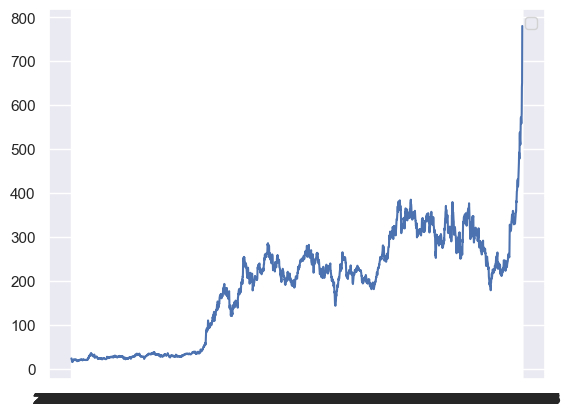
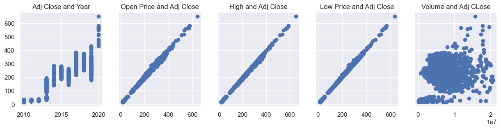
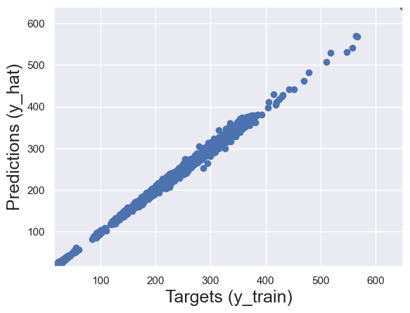

# Linear Regression With Tesla Stocks
This project demonstrates the implementation of linear regression to predict Tesla stock prices. 

Given data on date, open price, highest price, lowest price, closing price, adjusted price and volume. 

I use the standard approach to linear regression, including data preparation, model training, and estimation of the coefficient of determination (R²).

[Tesla stock data from 2010 to 2020](https://www.kaggle.com/datasets/timoboz/tesla-stock-data-from-2010-to-2020/data)

# Linear Regression in Jupyter Notebook 
For a detailed description of linear regression, please open the file [linear_regression.ipynb](https://nbviewer.org/github/LilPoly/Linear-Regression-With-Tesla-Stocks/blob/main/linear_regression.ipynb). 
Now, let's briefly talk about the most important things.

# Initial plot of stock prices by year
``` python
plt.plot(df['Date'], df['Adj Close'])
plt.legend()
plt.show()

```


# Outliers
After building the distplots, you can see a certain amount of outliers. In the future, the outliers will interfere with the correct construction of the linear regression.
So we can remove them using quantiles.
``` python
columns_quantiles = ['Open', 'Low', 'High', 'Adj Close', 'Volume']
q = 0.98

for col in columns_quantiles:
    q_val = data[col].quantile(q)
    data_1 = data[data[col]<q_val]
```
This will remove the top 2% percent of values.

# Date
The date in the dataset is an **object**, so we need to convert it to **datetime64[ns]**.
``` python
data_1['Date'] = pd.to_datetime(data_1['Date'])
```
For better work, we will only take one year from the date.
``` python
data_1['Year'] = data_1['Date'].dt.year
data_1.drop(['Date'], axis=1, inplace=True)
```
# Scatter
Next, we can make a scatter plot between the adjusted price and the open, low, high, and volume.
``` python
f, (ax1,ax2,ax3, ax4, ax5) = plt.subplots(1,5, sharey=True, figsize=(15,3))
ax1.scatter(data_cleaned['Year'],data_cleaned['Adj Close'])
ax1.set_title('Adj Close and Year')
ax2.scatter(data_cleaned['Open'], data_cleaned['Adj Close'])
ax2.set_title('Open Price and Adj Close')
ax3.scatter(data_cleaned['High'], data_cleaned['Adj Close'])
ax3.set_title('High and Adj Close')
ax4.scatter(data_cleaned['Low'], data_cleaned['Adj Close'])
ax4.set_title('Low Price and Adj Close')
ax5.scatter(data_cleaned['Volume'], data_cleaned['Adj Close'])
ax5.set_title('Volume and Adj CLose')

plt.show()
```


# Multicollinearity
Multicollinearity is a very important thing before constructing linear regression. Let's check it between values.
``` python
from statsmodels.stats.outliers_influence import variance_inflation_factor
variables = data_cleaned[['Open', 'High', 'Low', 'Year']]
vif = pd.DataFrame()
vif['VIF'] = [variance_inflation_factor(variables.values, i) for i in range(variables.shape[1])]
vif['features'] = variables.columns
```
|       | Open       | High       | Low        |
|-------|------------|------------|------------|
| Open  | 1.000000   | 0.999642   | 0.999595   |
| High  | 0.999642   | 1.000000   | 0.999582   |
| Low   | 0.999595   | 0.999582   | 1.000000   |

The multicollinearity is very high, so we can remove two values. We will leave only the Open Price.

The final table before linear regression will look like this.

| Open       | Adj Close  | Year |
|------------|------------|------|
| 19.000000  | 23.889999  | 2010 |
| 25.790001  | 23.830000  | 2010 |
| 25.000000  | 21.959999  | 2010 |
| 23.000000  | 19.200001  | 2010 |
| 20.000000  | 16.110001  | 2010 |

# Linear Regression Model
First we need to declare the inputs and the targets. We want to predict the price, so the adjusted price is the target. The open price and the year are the inputs.
``` python
inputs = data_cleaned[['Open', 'Year']]
target = data_cleaned['Adj Close']
```
# Scale the Data
Data-Scaling is typically achieved by applying either the ‘Normalization’ or ‘Standardization’ Data-Transforms. These are two different approaches, which both attempt to achieve the same goal: transform the raw data from its original scale to a more standard one.
To do this, we need to import StandardScaler.
``` python
from sklearn.preprocessing import StandardScaler
```
Next, we scale the inputs.
``` python
scaler = StandardScaler()
scaler.fit(inputs)
inputs_scaled = scaler.transform(inputs)
```
# Train Test Split
A machine learning model must be able to not only perform well on the data it is trained on, but also have the ability to generalize its knowledge to new, unknown data.

- The training set is used to train the model, that is, to build its parameters.

- The test set is used to test the model's performance on new data, to make sure that the model can "generalize" its conclusions, and not simply memorize (overfitting) the training data.

``` python
x_train, x_test, y_train, y_test = train_test_split(inputs_scaled, target, test_size=0.2, random_state=365)
```
# Create the regression
Next, we create a linear regression model, train it on the training data, and use it to predict values ​​on the same data.
``` python
reg = LinearRegression()
reg.fit(x_train, y_train)
y_hat = reg.predict(x_train)
```
Next, we will build a scatter plot.



